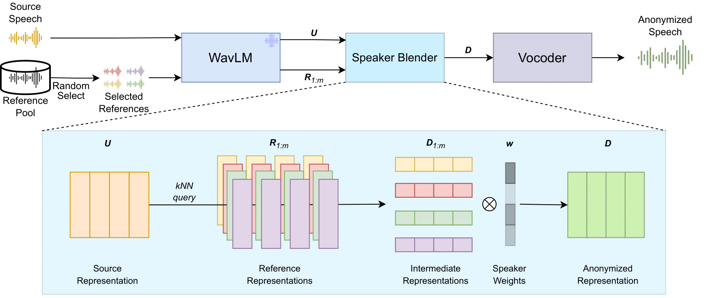

# SALT

> Take a grain of SALT to that voice!

**TL;DR**: A speaker anonymization and interpolation tool based on WavLM hidden space transformation.

Official code implementation for ASRU23 paper [SALT: Distinguishable Speaker Anonymization Through Latent Space Transformation](https://arxiv.org/abs/2310.05051).

[[Demo Page](https://bakerbunker.github.io/SALT/)] [[Paper](https://arxiv.org/abs/2310.05051)]

Try it out interactively at colab: 
<a target="_blank" href="https://colab.research.google.com/github/BakerBunker/SALT/blob/main/web_demo.ipynb">
  
</a>



## Quick start

1. **Install dependancies**: we have same dependencies as knn-vc: `torch`,`torchaudio`,`numpy`. And we also have `pandas` for data processing and `gradio` for web demo.
2. **Download prebuilt speaker packs** (Optional):
```bash
cd assets
wget https://github.com/BakerBunker/SALT/releases/download/1.0.0/librispeech-pack.zip
unzip librispeech-pack.zip
```
3. **Load model**: 
```python
import torch
anon = torch.hub.load('BakerBunker/SALT','salt', trust_repo=True, pretrained=True, base=True, device='cuda')
# base=True if use WavLM-Base as feature extractor
```
4. **Make speaker packs** (Optional)
```python
path=anon.make_speaker_pack(['tensor_or_path_to_wav',...],speaker_name)
```
5. **Add speakers**:
```python
anon.add_speaker('example',wavs=['tensor_or_path_to_wav',...])
#OR add .pack file by
anon.add_speaker('example',preprocessed_file='example.pack')
```
6. **Mix speakers**:
```python
wav=anon.interpolate(
    'tensor_or_path_to_wav',
    # Pandas Dataframe with column 'speaker' and 'weight'
    #OR
    # dict with {'speaker':weight},
    topk=4, #K for k-NN
)
```
## Checkpoints

WavLM-Large and corresponding vocoder is available at [kNN-VC](https://github.com/bshall/knn-vc#checkpoints).

WavLM-Base and corresponding vocoder is available at [release page](https://github.com/BakerBunker/SALT/releases).

Training process is same as [kNN-VC](https://github.com/bshall/knn-vc#training).


## Acknowledgement

Huge **THANKS** to [kNN-VC](https://github.com/bshall/knn-vc) and the authors, our code is largely based on this repository.

kNN-VC: https://github.com/bshall/knn-vc

Part of the code is based on:

HiFiGAN: https://github.com/jik876/hifi-gan

WavLM: https://github.com/microsoft/unilm/tree/master/wavlm

## Citation

```bibtex
@inproceedings{Lv2023SALTDS,
  title={SALT: Distinguishable Speaker Anonymization Through Latent Space Transformation},
  author={Yuanjun Lv and Jixun Yao and Peikun Chen and Hongbin Zhou and Heng Lu and Lei Xie},
  year={2023},
  booktitle={2023 IEEE Automatic Speech Recognition and Understanding (ASRU)},
}
```

