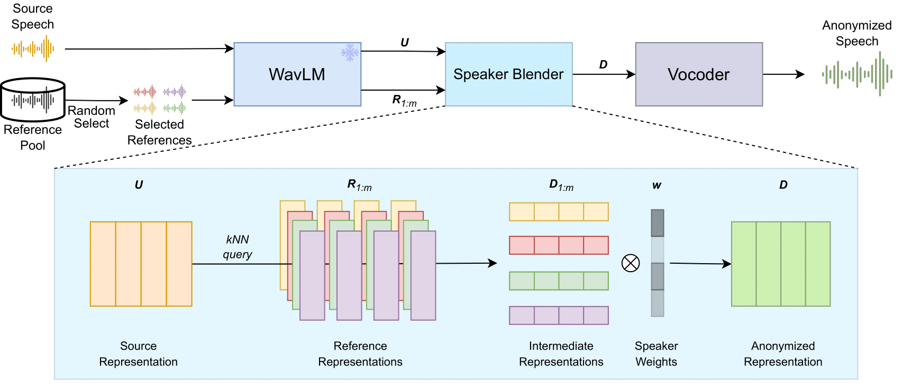

# SALT

[[Demo Page]()]

Official code implementation for ASRU23 paper SALT: Distinguishable Speaker Anonymization Through Latent Space Transformation.

We are cleaning and organizing our code.
Our code implementation will be released soon.

**TL;DR**: A speaker anonymization and interpolation tool based on WavLM hidden space transformation.

## Quick start

Will be updated after code release.

## Acknowledgement

Huge **THANKS** to [kNN-VC](https://github.com/bshall/knn-vc) and the authors, our idea and code is largely based on this repository.

## Citation

To be updated.

